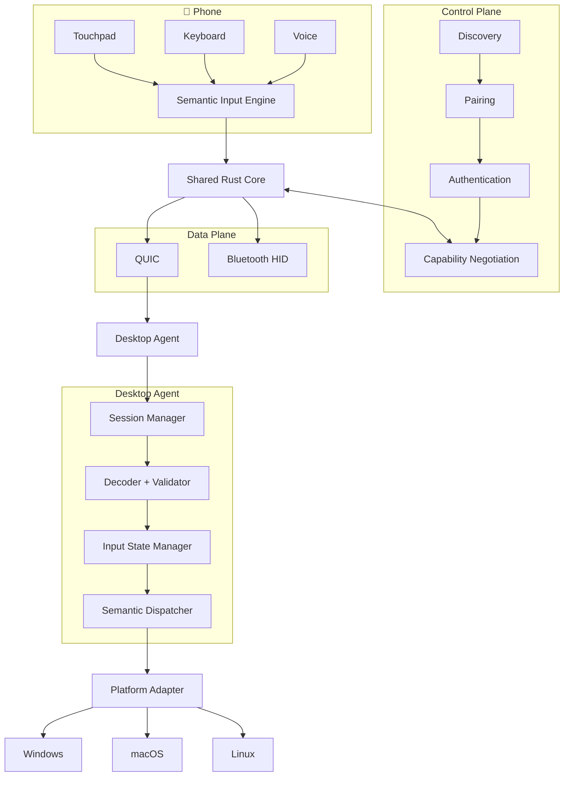
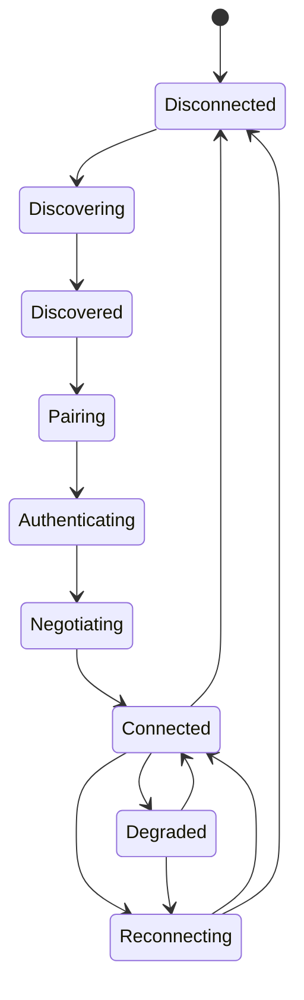

# Phone Input Relay

Turn your **Android or iPhone into a wireless input device** for your computer.

Phone Input Relay lets you use your phone as a:

* 🖱️ Touchpad / mouse
* ⌨️ Keyboard
* 🎙️ Voice-to-text input device
* 📋 Clipboard interface
* 🎛️ Consumer-key / media controller

Instead of streaming your computer's screen to the phone, the phone generates **semantic input events** and sends them to a desktop agent. The desktop agent translates those events into native operating-system input.

> **Emulate an input peripheral, not a screen.**

---

## ✨ Why Phone Input Relay?

A phone already has:

* A high-resolution touchscreen
* A software keyboard
* A microphone
* Wi-Fi / Bluetooth
* Modern device authentication capabilities

Phone Input Relay uses these capabilities to create a portable wireless input device without requiring a dedicated hardware keyboard or mouse.

The architecture is designed around a simple principle:

```text
Phone
  ↓
Semantic Input Events
  ↓
Transport
  ↓
Desktop Agent
  ↓
Native OS Input APIs
  ↓
Computer
```

The phone does **not** need to understand how Windows, macOS, or Linux injects input. Platform-specific behaviour stays inside the desktop agent.

---

# 🏗️ Architecture



---

# 🧩 Core Design

The system is divided into three major areas:

### 1. Control Plane

Responsible for establishing a trusted connection.

```text
Discovery
   ↓
Device Identification
   ↓
Pairing
   ↓
Authentication
   ↓
Capability Negotiation
   ↓
Session Establishment
```

Possible discovery mechanisms include:

* mDNS
* Bonjour
* Android NSD
* Manual IP
* QR-based endpoint information

---

### 2. Data Plane

Responsible for transmitting input events.

```text
Semantic Input Event
        ↓
Transport Interface
        ↓
 ┌──────┴──────┐
 ↓             ↓
QUIC       Bluetooth HID
```

The semantic event model remains independent of the underlying transport.

---

### 3. Platform Integration

The desktop agent converts semantic events into native operating-system input.

```text
              Semantic Event
                    │
                    ▼
             Platform Adapter
                    │
        ┌───────────┼───────────┐
        ▼           ▼           ▼
     Windows       macOS       Linux
    SendInput     CGEvent    X11/Wayland
```

This keeps OS-specific implementation at the edge of the system.

---

# 📱 Input Modes

## 🖱️ Touchpad

Touch events are processed locally on the phone before transmission.

```text
Raw Touch Events
      ↓
Gesture Classifier
      ↓
Velocity Estimation
      ↓
Acceleration
      ↓
Movement Coalescing
      ↓
60–120 Hz Scheduler
      ↓
MouseMove Event
```

This avoids unnecessarily transmitting every raw touch event and reduces network and battery overhead.

---

## ⌨️ Keyboard

Keyboard input supports two different concepts:

### Text Input

Used when the user wants to enter normal text.

```text
Phone Keyboard
      ↓
Unicode Text
      ↓
TextEvent
      ↓
Desktop Text Adapter
      ↓
Target Application
```

### Physical Key Events

Used for keys and shortcuts where physical key semantics matter.

```text
KeyDown
KeyUp
ModifierState
```

Keeping text input separate from physical key events allows shortcuts such as:

```text
Ctrl + C
Ctrl + V
Alt + Tab
Shift + ...
```

to be handled differently from normal Unicode text.

---

# 🎙️ Voice Input

Voice is treated as another source of semantic text.

```text
Microphone
    ↓
Audio Capture
    ↓
Voice Activity Detection
    ↓
Speech Recognition
    ↓
Partial / Final Transcript
    ↓
Text Input Engine
    ↓
Composition Events
    ↓
Desktop Agent
    ↓
Native Text Input
```

Both keyboard and voice input ultimately converge on the same text-input abstraction:

```text
Keyboard ─────┐
              │
Voice ────────┼──→ Text Input Engine
              │
Clipboard ────┘
```

Partial speech recognition can use composition semantics:

```text
CompositionStart
      ↓
CompositionUpdate
      ↓
CompositionUpdate
      ↓
CompositionCommit
```

This prevents partial transcripts from being repeatedly inserted as independent text.

---

# 🔐 Security

The system is designed around **explicit device identity and pairing** rather than relying only on an IP address or password.

```text
Phone Identity
     │
     ▼
 QR Pairing
     │
     ▼
Mutual Authentication
     │
     ▼
Authenticated Session
     │
     ▼
Encrypted Input Channel
```

The intended model is:

* Public/private device identity
* QR-based initial pairing
* Mutual authentication
* Encrypted sessions
* Explicit trust relationship

Clipboard access can additionally require explicit permission because clipboard contents may contain sensitive information.

---

# 🔄 Connection Lifecycle



Every transition to `Disconnected` must reset the input state.

```text
RESET_INPUT_STATE

→ Release held keys
→ Release mouse buttons
→ Clear modifiers
→ Cancel active drag
→ Terminate text composition
```

This prevents problems such as stuck:

* Ctrl / Shift / Alt keys
* Mouse buttons
* Drag operations
* Text compositions

---

# 🤝 Capability Negotiation

Phone and desktop capabilities may differ depending on platform and software version.

Example:

```text
Phone:
✓ mouse
✓ keyboard
✓ text
✓ composition
✓ voice
✓ clipboard

Desktop:
✓ mouse
✓ keyboard
✓ text
✓ composition
```

The session negotiates the intersection:

```text
Negotiated:
✓ mouse
✓ keyboard
✓ text
✓ composition
```

The phone UI can then adapt to the capabilities supported by the connected desktop.

---

# 🧱 Semantic Event Model

The protocol is transport-independent.

Conceptually:

```text
InputEvent
│
├── MouseMove
├── MouseButton
├── Scroll
│
├── KeyDown
├── KeyUp
├── ModifierState
│
├── Text
├── CompositionStart
├── CompositionUpdate
├── CompositionCommit
│
├── ClipboardRequest
├── ClipboardResponse
│
├── ConsumerKey
│
├── SessionEvent
└── DiagnosticEvent
```

Events can contain metadata such as:

```text
event_id
sequence_number
timestamp
session_id
```

This enables:

* Ordering checks
* Duplicate detection
* Latency measurement
* Debugging
* Diagnostics

---

# 🖥️ Supported Platforms

| Component     | Platform      | Status            |
| ------------- | ------------- | ----------------- |
| Phone App     | Android       | 🚧 Initial target |
| Phone App     | iOS           | 🗺️ Planned       |
| Desktop Agent | Windows       | 🚧 Initial target |
| Desktop Agent | macOS         | 🗺️ Planned       |
| Desktop Agent | Linux/X11     | 🗺️ Planned       |
| Desktop Agent | Linux/Wayland | 🗺️ Planned       |
| Bluetooth HID | Android       | 🗺️ Planned       |

The initial implementation focuses on **Android + Windows** before expanding to other platforms.

---

# 🛠️ Technology Stack

| Layer               | Technology                   |
| ------------------- | ---------------------------- |
| Android UI          | Jetpack Compose              |
| iOS UI              | SwiftUI                      |
| Shared Core         | Rust                         |
| Swift/Kotlin ↔ Rust | UniFFI                       |
| LAN Transport       | QUIC                         |
| Discovery           | mDNS / Bonjour / Android NSD |
| Pairing             | QR + Public-Key Identity     |
| Windows Input       | `SendInput`                  |
| macOS Input         | `CGEvent`                    |
| Linux Input         | X11 / Wayland                |
| Secure Storage      | Native OS Secure Storage     |
| Optional Transport  | Bluetooth HID                |

---

# 📂 Repository Structure

```text
phone-input-relay/
│
├── core/
│   ├── protocol/
│   │   ├── events.rs
│   │   ├── codec.rs
│   │   └── version.rs
│   │
│   ├── transport/
│   │   ├── transport.rs
│   │   └── quic.rs
│   │
│   ├── session/
│   │   ├── state.rs
│   │   ├── heartbeat.rs
│   │   └── capabilities.rs
│   │
│   ├── pairing/
│   │   ├── identity.rs
│   │   ├── pairing.rs
│   │   └── trust.rs
│   │
│   ├── input/
│   │   ├── event.rs
│   │   ├── state.rs
│   │   └── coalescer.rs
│   │
│   └── diagnostics/
│       └── metrics.rs
│
├── phone/
│   ├── android/
│   │   ├── ui/
│   │   ├── touchpad/
│   │   ├── keyboard/
│   │   ├── voice/
│   │   └── bridge/
│   │
│   └── ios/
│       ├── ui/
│       ├── touchpad/
│       ├── keyboard/
│       ├── voice/
│       └── bridge/
│
├── desktop/
│   ├── windows/
│   │   ├── agent/
│   │   └── input_adapter/
│   │
│   ├── macos/
│   │   ├── agent/
│   │   └── input_adapter/
│   │
│   └── linux/
│       ├── agent/
│       └── input_adapter/
│
├── tests/
│   ├── protocol/
│   ├── state/
│   ├── transport/
│   ├── latency/
│   └── integration/
│
├── docs/
│   ├── architecture/
│   ├── security/
│   └── protocol/
│
└── README.md
```

---

# 🚀 Development Roadmap

## MVP 0 — Core Proof

First prove the fundamental event path:

```text
Android
   ↓
QUIC
   ↓
Rust Windows Agent
   ↓
Windows SendInput
```

Supported:

* Mouse movement
* Mouse buttons
* KeyDown
* KeyUp
* Text

No Bluetooth, iOS, macOS, Linux, clipboard, or advanced voice pipeline at this stage.

---

## MVP 1 — Reliable Connection

Add:

* mDNS discovery
* QR pairing
* Public-key identity
* Authentication
* Capability negotiation
* Heartbeat
* Reconnection
* Input-state reset
* Latency instrumentation

---

## MVP 2 — Voice Input

Add:

```text
Android
   ↓
Microphone
   ↓
Speech Recognition
   ↓
Text / Composition
   ↓
QUIC
   ↓
Windows Agent
   ↓
Native Text Input
```

---

## Phase 3 — macOS + iOS

Reuse the shared:

* Protocol
* Session management
* Pairing
* Authentication
* Transport
* Input model
* Diagnostics

Only platform-specific layers need to change.

---

## Phase 4 — Bluetooth HID

Add Bluetooth HID behind the transport abstraction.

```text
Android
   ↓
Bluetooth HID
   ↓
Computer Bluetooth Stack
```

Bluetooth HID will provide a reduced capability set compared with the richer network protocol.

---

## Phase 5 — Linux

Initial target:

```text
Linux X11
```

followed by separate validation and integration for:

```text
Linux Wayland
```

---

# 🧪 Testing

Testing is divided into four layers.

### Protocol Tests

* Encoding / decoding
* Version mismatch
* Malformed events
* Sequence handling
* Duplicate events

### State Tests

* KeyDown → KeyUp
* Disconnect during KeyDown
* Disconnect during drag
* Modifier held during timeout
* Reconnect
* Duplicate events
* Out-of-order events
* Interrupted composition

### Platform Tests

* Windows `SendInput`
* macOS `CGEvent`
* Linux X11
* Linux Wayland

### End-to-End Tests

```text
Phone
  ↓
Network
  ↓
Transport
  ↓
Desktop Agent
  ↓
Platform Adapter
  ↓
Operating System
```

---

# 📊 Observability

The desktop agent should expose useful connection and input diagnostics.

Example:

```text
Connection
────────────────────
Status        Connected
Transport     QUIC
RTT           7.8 ms
Jitter        1.4 ms
Packet loss   0.0%

Input
────────────────────
Touch input   143 Hz
Sent events   72 Hz
Coalesced     48%
Dropped       0

Desktop
────────────────────
Decode        0.3 ms
Injection     0.7 ms

State
────────────────────
Held keys       0
Held buttons    0
Modifiers       0
Composition     inactive
```

The goal is to distinguish:

```text
Phone processing
      +
Network latency
      +
Desktop processing
      +
OS injection latency
```

rather than treating every delay as network latency.

---

# 🎯 Design Principles

### Semantic input over platform-specific input

The phone produces:

```text
MouseMove
KeyDown
Text
Composition
```

not Windows/macOS-specific events.

### Control plane separated from data plane

Discovery and pairing should not be mixed with high-frequency input traffic.

### Transport independence

QUIC and Bluetooth HID are transport implementations, not definitions of the semantic protocol.

### Text is a first-class operation

Keyboard and speech should converge on the same text-input system.

### OS-specific logic stays at the edge

Windows, macOS, and Linux differences belong inside platform adapters.

### Explicit input-state management

Disconnects must never leave stuck keys, modifiers, mouse buttons, drags, or compositions.

### Capability negotiation

Phone and desktop should agree on supported features before the session begins.

### Local high-frequency processing

Touch events should be classified, accelerated, coalesced, and scheduled before transmission.

### Device-based security

Pairing should establish an explicit trusted relationship between phone and desktop.

### Extensibility

Adding another platform or transport should not require rewriting the semantic event model.

---

# 📚 Documentation

Detailed architecture documentation is maintained separately:

```text
docs/
├── architecture/
├── protocol/
└── security/
```

The current architecture review and revised proposal is available in:

`Phone_Input_Relay_Architecture_Review_and_Revised_Proposal.md`

The main architectural recommendation is to preserve the original technology choices while establishing clearer boundaries between **input generation, semantic events, transport, session management, security, and OS-specific input injection**.

---

# 🤝 Contributing

Contributions are welcome.

Before implementing a new feature, consider which architectural layer it belongs to:

```text
Phone UI
   ↓
Input Engine
   ↓
Semantic Event Model
   ↓
Shared Core
   ↓
Transport
   ↓
Desktop Agent
   ↓
Platform Adapter
```

Avoid introducing platform-specific behaviour into the shared semantic protocol unless it is required by the protocol itself.

---

# 📄 License

License information will be added when the project is ready for public release.

---

## Project Status

🚧 **Early Development**

The architecture is defined, but implementation is being developed incrementally, starting with:

**Android → QUIC → Rust → Windows → SendInput**
